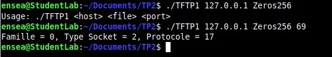

# TP2-TFTP
## Objectifs : Réaliser un client TFTP, à l’aide des RFC et de captures wireshark
### Le projet repose sur l'utilisation du protocole TFTP (Trivial File Transfer Protocol) pour l'échange de fichiers. Les spécifications techniques sont décrites dans les RFC suivantes :

## TFTP Client Implementation

### **Objectif**
Réaliser un client TFTP capable d’échanger des fichiers en utilisant les RFCs et les captures réseau **Wireshark**.

---

### **Protocole**
Le projet repose sur l'utilisation du protocole **TFTP (Trivial File Transfer Protocol)** pour l'échange de fichiers. Les spécifications techniques sont décrites dans les RFC suivantes :
- **RFC1350** : TFTP v2
- **RFC2347** : TFTP Option Extension
- **RFC2348** : TFTP Blocksize Option
- **RFC2349** : TFTP Timeout & TSize Option

Le protocole est fréquemment utilisé dans :
- L’installation d’OS via PXE.
- La mise à jour de firmwares et les systèmes embarqués.

---

### **Environnement de test**
Pour tester votre client TFTP, choisissez l'une des deux options suivantes :
1. **Serveur local** : Installez un serveur TFTP avec :
   ```bash
   sudo apt install atftp
   ```
   Placez les fichiers dans `/srv/tftp`.

2. **Serveur distant** : Utilisez le serveur distant situé sur :
   ```
   srvtpinfo1.ensea.fr, port 69
   ```

### **Capture de paquets** :
Pour analyser le fonctionnement du protocole, utilisez **Wireshark** ou **netcat** et **hexdump** :
```bash
nc -l -u 1069 | hexdump -C
```

---

### **Travail réalisé**

#### **1. Objectifs**
Développez un client capable de :
- **Télécharger un fichier** depuis un serveur TFTP avec la commande :
   ```bash
   s gettftp host file
   ```
- **Téléverser un fichier** vers le serveur :
   ```bash
   s puttftp host file
   ```

#### **2. Fonctionnalités implémentées**
Implémentez les fonctionnalités suivantes dans cet ordre :
1. **Arguments passés en ligne de commande** :
int main(int argc, char *argv[]) {
    if (argc != 4) {
        printf("Usage: %s <host> <file> <port>\n", argv[0]);
        return 1;
    }


2. **Appel à getaddrinfo pour obtenir l’adresse du serveur ;** pour la connexion au serveur.
   // Configuration des attributs de la structure hints
    memset(&hints, 0, sizeof(struct addrinfo));
    hints.ai_family = AF_INET;       // IPv4 uniquement
    hints.ai_socktype = SOCK_DGRAM;  // Socket UDP
    hints.ai_protocol = IPPROTO_UDP;  // Protocole UDP

    // Résolution de l'adresse du serveur
    e = getaddrinfo(argv[1], "69", &hints, &res);
    if (e != 0) {
        fprintf(stderr, "getaddrinfo: %s\n", gai_strerror(e));
        exit(EXIT_FAILURE);
    }

    img2
3. **Réservation d’un socket de connexion vers le serveur** :
    // Creation of UDP socket
    int sockfd = socket(AF_INET, SOCK_DGRAM, IPPROTO_UDP);
    if (sockfd < 0) {
    perror("Erreur lors de la création du socket");
    exit(EXIT_FAILURE);
}
 // send message via sendto()
    if (sendto(sockfd, bufT, msg_len, 0, (struct sockaddr*)&server_addr, sizeof(server_addr)) < 0) {
        perror("Erreur lors de l'envoi du message");
        exit(EXIT_FAILURE);
    }
	printf("Message envoyé au serveur %s sur le port %s.\n", argv[1], argv[3]);
close(sockfd);
img3
 
4. **requête de lecture (RRQ)** :
   - Envoi d’une **requête de lecture (RRQ)** ou **d’écriture (WRQ)** correctement formée.
    // Préparation of message to send 
    // char bufT[300] = "Message depuis le client UDP !";
    char bufT[300] = "Message depuis le client UDP !";

    int msg_len = strlen(bufT);
	
    // preparation of trame RRQ/WRQ 
    char bufTsended[309];

	bufTsended[0] = 0x00;  
	bufTsended[1] = 0x01;  

	memcpy(&bufTsended[2], bufT, msg_len);

	bufTsended[2 + msg_len] = 0x00;

	char mode[] = "octet";
	int mode_len = strlen(mode);
	memcpy(&bufTsended[3 + msg_len], mode, mode_len);

	bufTsended[3 + msg_len + mode_len] = 0x00;

	int bufTsended_len = 4 + msg_len + mode_len;

    img4
   - Réception et gestion des **paquets de données (DAT)** et des **accusés de réception (ACK)**.
   - Détection de paquets hors séquence.
   - Gestion des retransmissions en cas d’erreurs.

---

### **Tests**
- **Téléchargement d’un fichier** via `gettftp` :
   ```bash
   ./TFTP4 srvtpinfo1.ensea.fr fichier_test
   ```
- **Analyse des trames** avec **Wireshark** pour valider les échanges UDP.

---

### **RFCs utilisées**
- [RFC1350 - TFTP v2](https://datatracker.ietf.org/doc/html/rfc1350)
- [RFC2347 - TFTP Option Extension](https://datatracker.ietf.org/doc/html/rfc2347)
- [RFC2348 - TFTP Blocksize Option](https://datatracker.ietf.org/doc/html/rfc2348)
- [RFC2349 - TFTP Timeout Option](https://datatracker.ietf.org/doc/html/rfc2349)

---

### **Prérequis**
- **Wireshark** pour analyser les paquets.
- Environnement Linux avec support des sockets UDP.
- Compilateur C (GCC).

---

### **Compilation**
Compilation de projet avec :
```bash
gcc -o tftp_client tftp_client.c
```

---

### **Exemple d’exécution**
**Téléchargement** :
```bash
./tftp_client gettftp srvtpinfo1.ensea.fr fichier_test PORT
```

**Téléversement** :
```bash
./tftp_client puttftp srvtpinfo1.ensea.fr fichier_test PORT
```

---

### **Auteurs**
- **HAKKI Houssam**  
- **AFIF Ikram**  

---

### 📂 **Structure du projet**
```plaintext
.
├── TFTP1.c        # Code source du client TFTP
├── TFTP3_4.c        # Code source du client TFTP
├── TFTP4.c        # Code source du client TFTP
├── README.md            # Ce fichier
├── tftp_client.c        # Code source du client TFTP******
└── captures/            # Captures Wireshark

---
